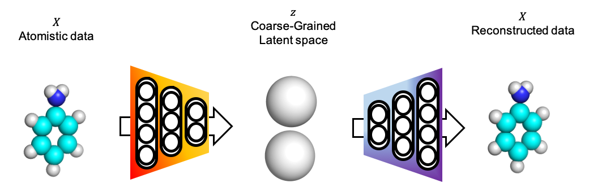
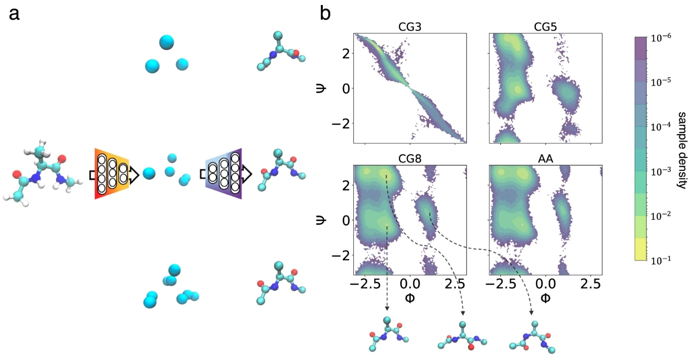

# Coarse-Graining-Auto-encoders

Implementation of coarse-graining Autoencoders for our paper https://www.nature.com/articles/s41524-019-0261-5/

You can check out a Colab walk-through demo [here](https://colab.research.google.com/github/wwang2/Coarse-Graining-Auto-encoders/blob/master/cgae_alanine_dipeptide_colab_walkthrough.ipynb)

We include several simple examples of coarse-graining molecules.

<p align="center">
  
</p>
<p align="center">
   
   
</p>

Coarse-Grained latent space of alanine dipeptide
<p align="center">
  
</p>

required packages:
```
mdtraj     1.9.2
pytorch    1.1.0 
numpy
```

To cite our work:

```
@article{Wang2018Coarse,
author = {Wang, Wujie and G{\'{o}}mez-Bombarelli, Rafael},
doi = {10.1038/s41524-019-0261-5},
isbn = {4152401902615},
issn = {2057-3960},
journal = {npj Computational Materials},
mendeley-groups = {MSM},
month = {dec},
number = {1},
pages = {125},
publisher = {Springer US},
title = {{Coarse-graining auto-encoders for molecular dynamics}},
url = {http://www.nature.com/articles/s41524-019-0261-5 http://dx.doi.org/10.1038/s41524-019-0261-5},
volume = {5},
year = {2019}
}

```
